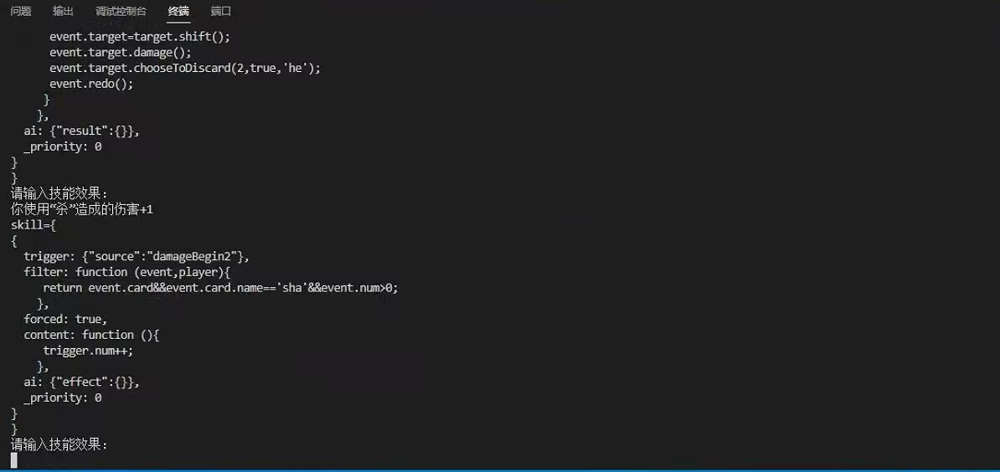

# 无名杀AI

该项目旨在通过输入技能效果，生成无名杀技能代码的AI。

## 配置要求

为了更好地满足使用需求，请尽可能满足以下要求:

- 电脑（必须）
- 硬盘存储空间20G以上（必须）
- 若使用完整非量化版本/gpu版懒人一键包，对于具有 NVIDIA 显卡的电脑，采用gpu推理，要求显存 + 电脑物理内存（物理内存不包含虚拟内存）的一半 >= 16G
- 若使用完整非量化版本/cpu版懒人一键包，采用cpu方式推理，对于无显卡的电脑，要求内存（可包含虚拟内存）尽可能满足 >= 32G

## 使用方法

1. 安装 Python 以及相应的 Python 编译器
  - 注意：python适配版本为3.8,3.9,3.10,3.11，请勿安装过高或过低版本
3. 在终端（命令行）中输入以下命令安装依赖环境:

   ```bash
   pip install -r requirements.txt
   ```

4. 下载模型文件并放入 `models` 文件夹中，最终目录应为 `xx/models/QWen-7B-Chat`

   模型下载地址:
   - [huggingface地址](https://huggingface.co/Qwen/Qwen-7B-Chat)
   - [百度网盘地址](https://pan.baidu.com/s/1OrB_dEACkyhp-iOkP2RkJg?pwd=6666) 百度网盘提取码：6666

5. 下载权重文件并放入 `checkpoint` 文件夹中，最终目录应为 `xx/model/版本`

   checkpoint 下载地址，请选择合适的版本进行下载:
   - [百度网盘地址](https://pan.baidu.com/s/1nugDoRroD2I0dX3fcP9umA?pwd=6666) 百度网盘提取码：6666

6. 运行 Python 脚本:

   ```bash
   python demo.py
   ```
## 懒人一键包
- 一键安装，无需烦恼
- 请根据自身配置选择合适的懒人一键包
- Nvidia显卡，并且显存的全部+物理内存的一半达到16G，可以选择gpu版，gpu版能够获得更好的效果和更快的生成速度
- AMD显卡，或者显存+物理内存的一半达不到16G要求的，可以选择cpu版，cpu版只需要内存（可包括虚拟内存）大于32G即可，cpu版所需配置低，并且占用空间小，缺陷是效果更差，生成更慢
- [懒人一键包百度网盘下载地址](https://pan.baidu.com/s/1zIcRZtQv5oIdu7_abie9Vw?pwd=6666) 百度网盘提取码：6666
## 网页版/服务器部署
   - 安装 Python 
   - 安装依赖环境
   ```bash
   pip install -r requirements.txt
   ```
  - 安装streamlit
   ```bash
   pip install streamlit
   ```
   - 服务器放行8501端口（也可自行改成其他，需要和webdemo.py文件中对应）
   - 运行webdemo
   ```bash
   streamlit run webdemo.py
   ```
   
## 网页版/服务器示例


## 注意事项

- AI生成受不可控因素影响，生成的代码不保证100%有效，仍可能出现bug、冗余代码或额外特殊符号等，需要人工修改。
- （重要）遵循AI规范，本AI模型仅用于学习交流使用，请勿用于不法用途以及商业用途。本人发布该模型初衷是希望大家更好地学习和交流，模型涉及的所有相关信息都是公开的。对于恶意使用本AI模型的，本人概不负责。

## 其他内容

如果有相关问题，请在GitHub官方的issue中提出。

## 演示图片





## 赞助
- 厚颜无耻的求一个赞助

