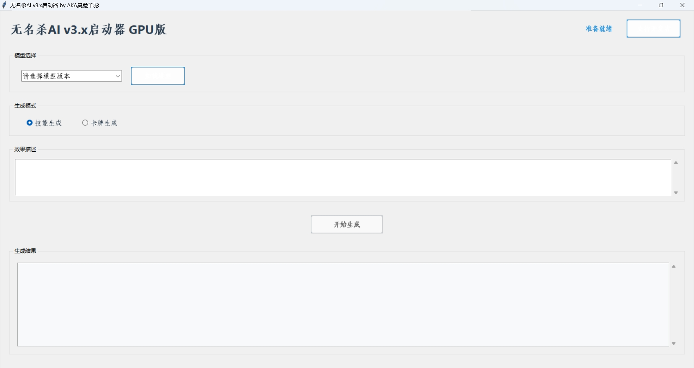
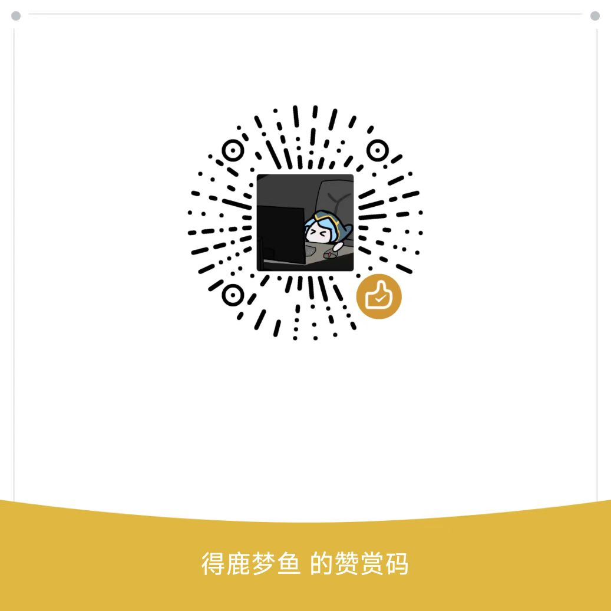

[切换到中文版本](README_zh.md) 

[Switch to English Version](README.md)

# Noname AI

Projects related to Noname AI/Noname AI, involving AI programs aimed at generating Noname skill codes by inputting skill effects.

[modelscope (Magic Community) Online Experience](https://www.modelscope.cn/studios/huskyhong/nonameai)

Due to limited computing power, the online experience version is only a lightweight CPU version with limited precision. If needed, please choose the GPU version or full version for inference.
Fine-tuned from QWen.

## Configuration Requirements

To better meet usage requirements, please try to meet the following requirements:

- Computer (required)
- Hard disk storage space of 20G or more (required)
- If using the full non-quantized version/GPU version lazy one-click package, for computers with NVIDIA graphics cards, GPU inference is used, requiring half of the graphics memory + computer physical memory (physical memory does not include virtual memory) >= 16G
- If using the full non-quantized version/CPU version lazy one-click package, CPU inference is used, requiring memory (including virtual memory) to be as close as possible to >= 32G for computers without graphics cards
- If using the lightweight version/GPU version lightweight lazy one-click package, for computers with NVIDIA graphics cards, GPU inference is used, requiring half of the graphics memory + computer physical memory (physical memory does not include virtual memory) >= 4G
- If using the lightweight version/CPU version lightweight lazy one-click package, CPU inference is used, requiring memory (including virtual memory) to be as close as possible to >= 12G for computers without graphics cards

## Usage

### Full Model Method

1. Install Python and the corresponding Python compiler.
   - Note: Python compatible versions are 3.8, 3.9, 3.10, 3.11. Please do not install versions that are too high or too low.
2. Enter the following command in the terminal to install the required environment:

   ```bash
   pip install -r requirements.txt
   ```

3. Run the program using the following Python code. The model will be automatically downloaded, and the code defaults to version 2.0 full version.
```python
from transformers import AutoModelForCausalLM, AutoTokenizer
from transformers.generation import GenerationConfig
tokenizer = AutoTokenizer.from_pretrained("huskyhong/noname-ai-v2", trust_remote_code=True)
model = AutoModelForCausalLM.from_pretrained("huskyhong/noname-ai-v2", device_map="auto", trust_remote_code=True).eval() # Load the model using GPU
# model = AutoModelForCausalLM.from_pretrained("huskyhong/noname-ai-v2", device_map="cpu", trust_remote_code=True).eval() # Load the model using CPU
model.generation_config = GenerationConfig.from_pretrained("huskyhong/noname-ai-v2", trust_remote_code=True) # You can specify different generation lengths, top_p, and other related hyperparameters
# For the first generation model, replace "huskyhong/noname-ai-v2" with "huskyhong/noname-ai-v1". For lightweight version v2.3 model, replace "huskyhong/noname-ai-v2" with "huskyhong/noname-ai-v2_3-light"

prompt = "请帮我编写一个技能，技能效果如下：" + input("请输入技能效果：")
response, history = model.chat(tokenizer, prompt, history = [])
print(response)

prompt = "请帮我编写一张卡牌，卡牌效果如下：：" + input("请输入卡牌效果：")
response, history = model.chat(tokenizer, prompt, history = [])
print(response)
```
Alternatively, you can use Hugging Face's pipeline for inference.
```python
from transformers import pipeline, AutoTokenizer, AutoModelForCausalLM, GenerationConfig
generator = pipeline(
    "text-generation",
    model="huskyhong/noname-ai-v2",
    tokenizer="huskyhong/noname-ai-v2",
    device=0,  # Choose GPU device. If you want to use CPU, you can set device=-1
    trust_remote_code=True
)

prompt = "请帮我编写一个技能，技能效果如下：" + input("请输入技能效果：")
response = generator(prompt, max_length=50, top_p=0.95)  # You can adjust parameters such as generation length, top_p as needed
print(response[0]['generated_text'])

prompt = "请帮我编写一张卡牌，卡牌效果如下：" + input("请输入卡牌效果：")
response = generator(prompt, max_length=50, top_p=0.95)  # You can adjust parameters such as generation length, top_p as needed
print(response[0]['generated_text'])
```

4. If automatic downloading fails, you can manually download the model files and modify "huskyhong/noname-ai-v2" to the corresponding location in the code.
   Download links for the second-generation model:
   - [v2.0 Hugging Face address (full version)](https://huggingface.co/huskyhong/noname-ai-v2)
   - [v2.3 Hugging Face address (lightweight version)](https://huggingface.co/huskyhong/noname-ai-v2_3-light)
   - [Baidu Netdisk address](https://pan.baidu.com/s/1m9RfGqnuQbRYROE_UzuG-Q?pwd=6666) Baidu Netdisk extraction code: 6666
   Download links for the first-generation model:
   - [Hugging Face address](https://huggingface.co/huskyhong/noname-ai-v1)
   - [Baidu Netdisk address](https://pan.baidu.com/s/1Ox471XuHF_gJbcPPnSZe7g?pwd=6666) Baidu Netdisk extraction code: 6666
Remember to choose whether to load the model using GPU or CPU, and replace `your_model_name` with your actual model path.

## Lazy One-Click Package

- One-click installation, no worries.
- Please choose the appropriate lazy one-click package according to your own configuration.
- [Lazy One-Click Package Baidu Netdisk Download Address (Updated to v2.3)](https://pan.baidu.com/s/1zIcRZtQv5oIdu7_abie9Vw?pwd=6666) Baidu Netdisk extraction code: 6666
- [Lazy One-Click Package 123 Netdisk Download Address (Updated to v2.3)](https://www.123pan.com/s/lOcnjv-pnOG3.html) 123 Netdisk extraction code: 6666
- Please pay attention to the version time of the lazy one-click package to ensure that the version is the latest!
- Lazy package related videos
- [Comparison of Effects of Lazy Package v2.3](https://www.bilibili.com/video/BV1at421V7Qu)

## Web Version/Server Deployment
   - Install Python
   - Install dependencies
   ```bash
   pip install -r requirements.txt


   ```
  - Install Streamlit
   ```bash
   pip install streamlit
   ```
   - Allow port 8501 on the server (can also be changed to others, corresponding to webdemo.py file)
   - Run webdemo
   ```bash
   streamlit run webdemo.py
   ```
   
## Web Version/Server Example


## Notes

- AI generation is subject to uncontrollable factors, and the generated code does not guarantee 100% effectiveness. Bugs, redundant code, or additional special characters may still occur and require manual modification.
- (Important) Follow AI specifications. This AI model is for learning and communication purposes only. Please do not use it for illegal or commercial purposes. The purpose of releasing this model is to encourage better learning and communication, and all related information involved in the model is public. I bear no responsibility for malicious use of this AI model.

## Other Content

If you have any related questions, please raise them in the official GitHub issue.

## Demo Images
These demo images are based on version 2.3 release.  



## Sponsorship
- Shamelessly begging for sponsorship

